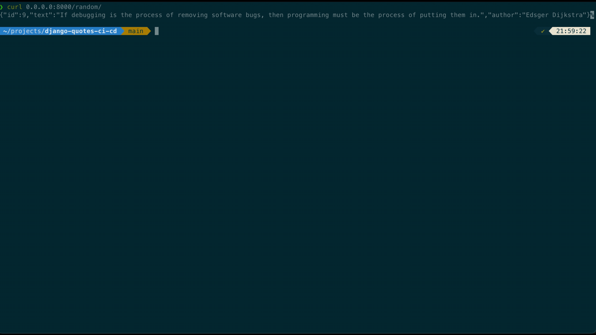

# Random Quote API

A mini Django REST API that returns programming quotes. Built to showcase CI/CD, testing, and Docker workflow.

## Features
- Django + DRF API
- `/random/` returns a random quote
- `/` returns a list of quotes
- Dockerized app
- CI pipeline with GitHub Actions:
  - `unittest` for testing
  - `flake8` for linting
  - `black` for formatting

## Requirements
- [Docker Desktop](https://www.docker.com/products/docker-desktop/) installed and running.

## Usage
- Run `docker compose up` to start the server.
- Access the API at `http://localhost:8000/` for a list of quotes.
- Access the API at `http://localhost:8000/random/` for a random quote.

